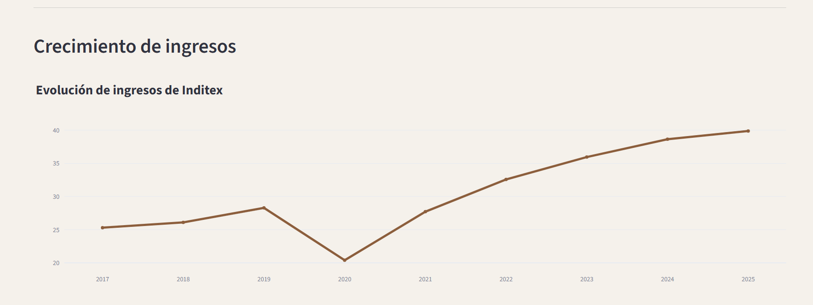
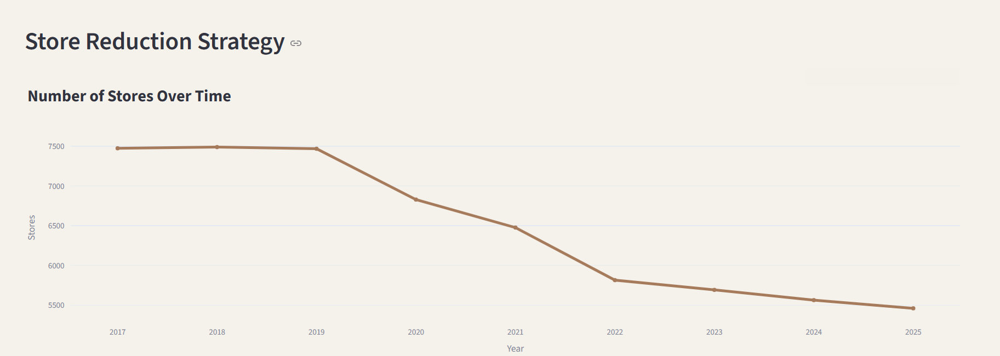

# Inditex: La Metamorfosis del Valor (2017–2025)

Proyecto de análisis de datos enfocado en la transformación estratégica de Inditex entre 2017 y 2025 utilizando Python, Streamlit y visualización de datos interactiva.

---

## Descripción del Proyecto

Este proyecto analiza la evolución financiera, operativa y digital de Inditex entre 2017 y 2025 a través de indicadores clave relacionados con ingresos, rentabilidad, expansión digital y reducción de tiendas físicas.

El objetivo principal fue identificar cómo la compañía pasó de un modelo tradicional de fast fashion hacia un ecosistema más eficiente, digital y orientado al valor agregado.

El análisis combina exploración de datos, visualización interactiva y narrativa estratégica para evaluar cambios estructurales dentro del retail global de moda.

---

## Objetivos del Análisis

- Analizar la evolución financiera de Inditex entre 2017 y 2025.
- Evaluar el impacto de la transformación digital después de 2020.
- Identificar patrones entre reducción de tiendas y crecimiento financiero.
- Explorar cambios estratégicos dentro del modelo tradicional de fast fashion.
- Visualizar tendencias mediante dashboards interactivos y gráficos dinámicos.

---

## Herramientas Utilizadas

- Python
- Pandas
- Streamlit
- Plotly
- Excel
- Power BI

---

## Principales Hallazgos

- Inditex mostró una recuperación financiera sólida después de 2020.
- La compañía redujo significativamente su número de tiendas físicas entre 2019 y 2025.
- Las ventas online aumentaron considerablemente después de la pandemia.
- Los indicadores de rentabilidad continuaron creciendo incluso con menos tiendas físicas.
- Los resultados sugieren una transición gradual desde un modelo tradicional de fast fashion hacia una estrategia premium-digital más eficiente.

---

## Interpretación Estratégica

Los resultados sugieren que Inditex está atravesando una transformación estructural dentro de la industria global del retail de moda.

La reducción de tiendas físicas no parece representar una contracción del negocio, sino una reconfiguración estratégica enfocada en eficiencia operativa, monetización digital y fortalecimiento de marca.

El crecimiento sostenido de ingresos, EBITDA y ventas online podría indicar un desacoplamiento progresivo entre presencia física y generación de valor financiero.

Al mismo tiempo, el análisis sugiere que la compañía podría estar moviéndose hacia un posicionamiento híbrido:

- Más ágil que el lujo tradicional.
- Más exclusivo que el ultra-fast fashion de bajo costo.
- Más dependiente de ecosistemas digitales y branding global.

---

## Dashboard Interactivo

### Versión Español
[Ver aplicación en Streamlit]([AQUI_LINK_ES](https://inditex-strategic-analysis-bpjqrgbo2gounhpswtcru7.streamlit.app/))

### English Version
[View Streamlit App](https://inditex-strategic-analysis-hexzgfccvpmtv87tu88mew.streamlit.app/)

---

## Vista Previa del Dashboard

### Dashboard Español

---

### Dashboard English

---

## Archivos del Proyecto

- Dashboard interactivo en Streamlit
- Visualizaciones y gráficos
- Bases de datos utilizadas
- Análisis exploratorio en Python

---

## Pregunta de Investigación

¿Está dejando Inditex atrás el modelo tradicional de fast fashion?

Los datos sugieren una posible transición hacia un modelo híbrido donde la eficiencia digital, la reducción estratégica de tiendas y el posicionamiento de marca comienzan a tener más relevancia que la expansión física masiva característica del fast fashion tradicional.
